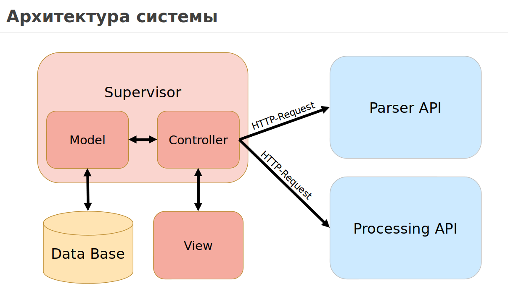
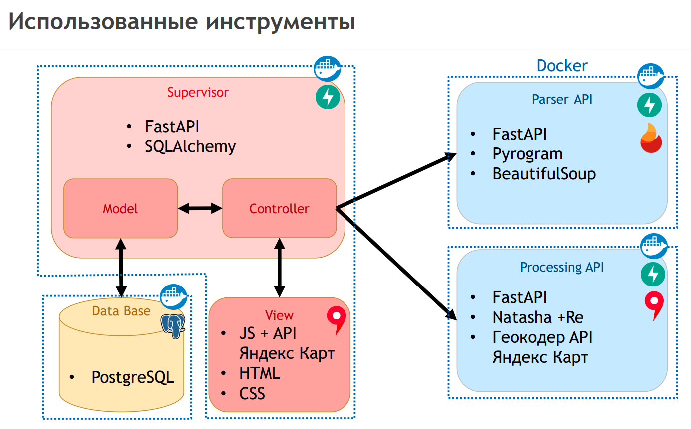

# CityMonitoringHCS

City Monitoring of Housing and Communal Systems

Целью курсовой работы является создание веб-сайта для визуализации
жилищно-коммунальных неполадок города Саратов. Программа должна собирать 
жалобы горожан с открытых источников, распознавать адреса и категорию жалоб, а 
после отображать на карте в виде соответствующих меток.

Результатом работы программы является сайт, отображающий основные проблемы 
городского хозяйства, влияющие на качество жизни горожан. Для реализации проекта
были разработаны сервисы:

- [Основной сервис](src/supervisor/README.md)
- [Сервис для парсинга](src/parser_service/README.md)
- [Сервис для обработки текста](src/nlp_service/README.md)




### Build & Run
```commandline
docker-compose up --build
```

### Shutdown
```commandline
docker-compose down 
```

### .env
Переменные среды для...
- Блок 1. Telegram
- Блок 2. YandexMaps API
- Блок 3. PostgreSQL

Пример, как можно получить SESSION_STRING:
```commandline
import asyncio
from pyrogram import Client
from dotenv import load_dotenv

API_ID = os.getenv("API_ID")
API_HASH = os.getenv("API_HASH")
SESSION = os.getenv("SESSION")

async def main():    
    app = Client("CM_HCS_account", api_id=API_ID, api_hash=API_HASH, phone_number=SESSION)
        async with app:
            session_string = await app.export_session_string()
            print(session_string)

asyncio.run(main())
```


