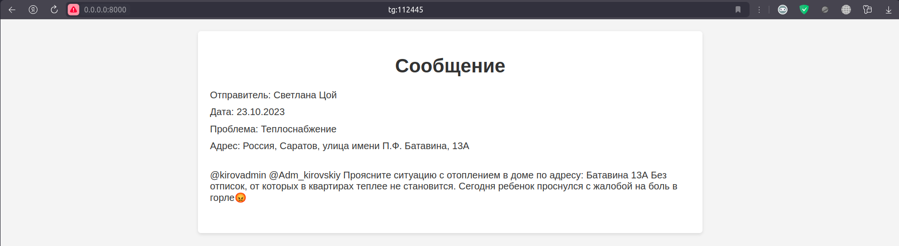
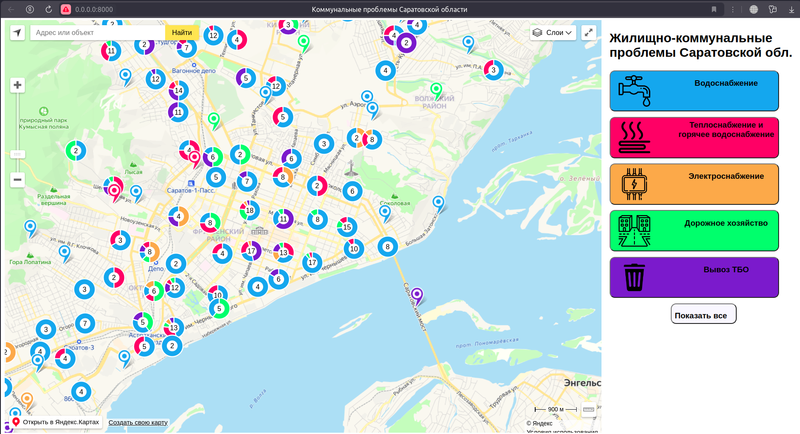
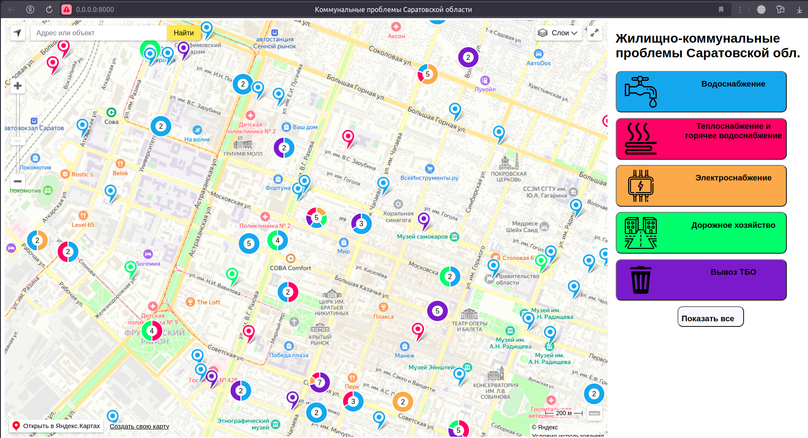
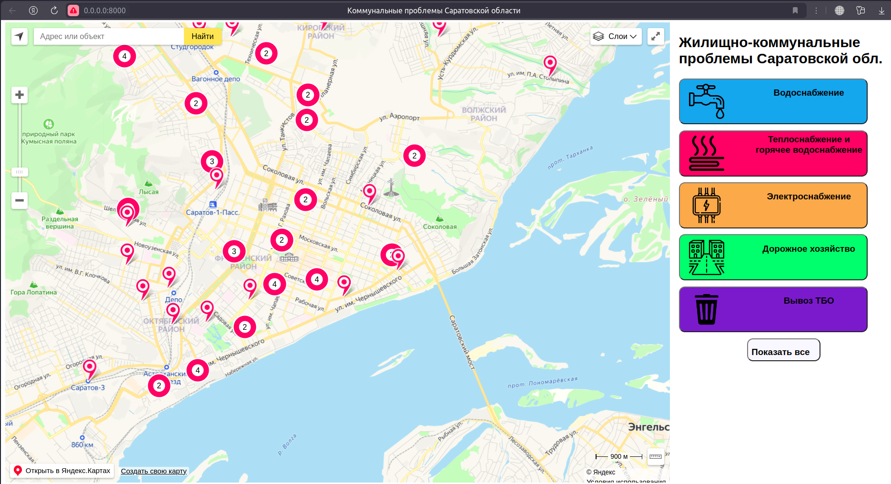
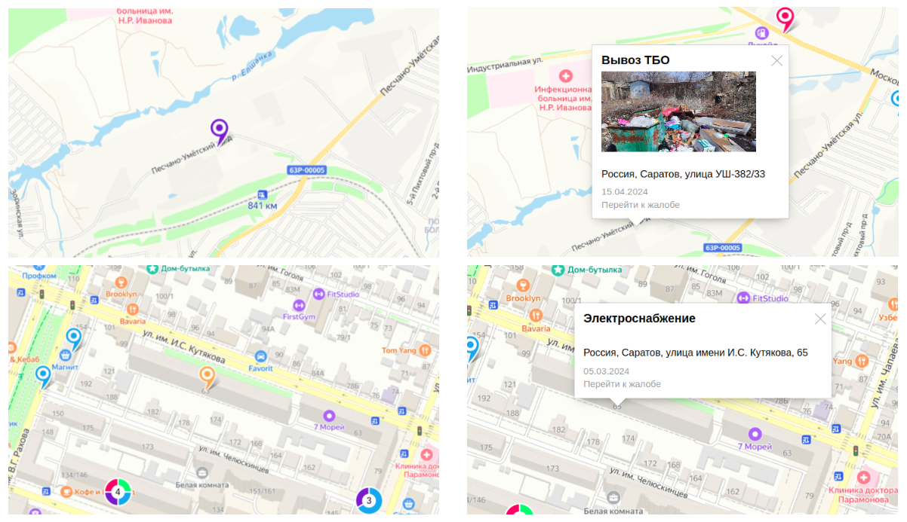
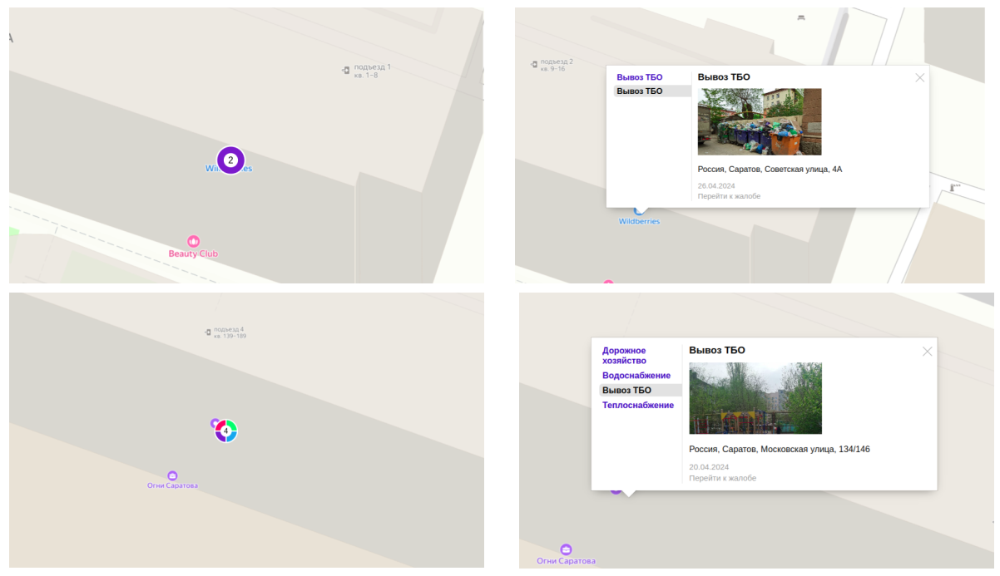

# supervisor

Основной севис, связывающий остальные сервисы, базу данных и отображающий общий результат
работы проекта. 

Получает спаршенные данные с помощью `parser_service`, обрабатывает их с помощью 
`nlp_service`. Фильтрует данные и использует базу данных для их хранения.
Отображает накопленные данные на интерактивной карте при помощи средств JavaScript 
YandexMaps API.

> ### `GET /messages/{source}/`
> Возвращает список записей с заданного ресурса.
>
> Параметры:
> - `source` (string) - ресурс, с которого нужно просмотреть полученные данные.
>
> Ответ:
> - (html) - страница со списком всех записей из данного ресурса с кликабельными
> ссылками на каждое отдельное сообщение (см. след. запрос).
> 
> 

> ### `GET /messages/{source}/{is_new}/`
> Возвращает список новых записей с конкретного ресурса.
>
> Параметры:
> - `source` (string) - ресурс, с которого нужно просмотреть полученные данные.
> - `is_new` (string = {new | old}) - индикатор того, какие сообщения будут парситься: новые или старые.
> Сделано в первую очередь для Telegram, откуда нельзя спарсить сразу все сообщения.
>
> Ответ:
> - (html) - страница со списком всех новых записей из данного ресурса с кликабельными
> ссылками на каждое отдельное сообщение.

> ### `GET /messages/{source}/{local_id}`
> Возвращает конкретное сообщение с заданного ресурса.
>
> Параметры:
> - `source` (string) - ресурс, с которого нужно просмотреть полученные данные.
> - `local_id` (integer) - локальный идентификатор сообщения на этом ресурсе.
>
> Ответ:
> - (html) - страница конкретной записи.
> 
> 
> 

> ### `GET /map`
> Возвращает страницу с интерактивной картой, отображающей проблемы на объектах.
>  
> 
> 
> 
> 
> 
